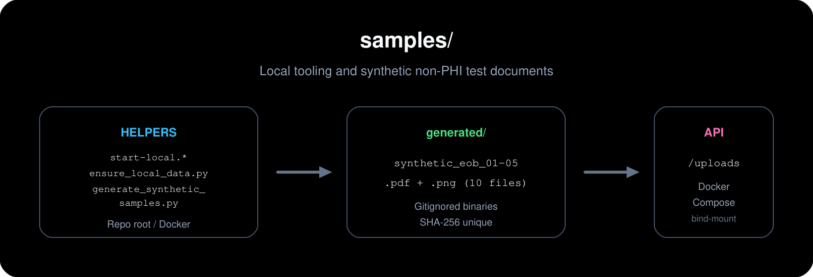

<div align="center">

# Samples

**Local helpers & synthetic documents** for RCM Guardian (no real PHI).

[](./README.md)
[](../docker-compose.yml)
[](https://www.python.org/)

<br/>



*Source: [`samples-hub.svg`](./assets/samples-hub.svg). Regenerate PNGs from SVG: **`python samples/render_readme_assets.py`** (repo root).*

</div>

---

## Contents

| | |
| :--- | :--- |
| 📂 | [What lives here](#what-lives-here) |
| 🔢 | [Ordinal reference](#ordinal-reference) |
| ⚡ | [Commands](#commands) |

---

## What lives here

| Path | Purpose |
|------|---------|
| **`start-local.ps1`** / **`start-local.sh`** | From **repo root**: checks `.env` for OpenAI + LangSmith keys, ensures **`samples/generated/`** exists, then **`docker compose up --build`**. |
| **`ensure_local_data.py`** | Seed payer rules without starting the API: `python samples/ensure_local_data.py` |
| **`generate_synthetic_samples.py`** | Fills **`generated/`** — see [**Ordinal reference**](#ordinal-reference) and **Commands**. |
| **`render_readme_assets.py`** | Rasterize **`assets/*.svg` → `*.png`** (PyMuPDF). |
| **`generated/`** | **Gitignored** outputs; Compose bind-mounts this folder to **`/uploads`** in **`api`**. |
| **`assets/`** | Diagram **`.svg`** + **`.png`** previews for this README. |

---

## Ordinal reference

Output paths: **`samples/generated/synthetic_eob_<NN>.pdf`** and **`.png`** for **NN = 01 … 05** (10 files). Each ordinal uses **two different documents** for PDF vs PNG (not a raster of the PDF); text and `asset_key` differ. Source: **`PAIRS`** in [`generate_synthetic_samples.py`](./generate_synthetic_samples.py).

| Ordinal | PDF scenario | PNG scenario |
|--------|-------------|-------------|
| 01 | EOB / office + lab | Pharmacy remittance |
| 02 | Urgent care claim summary | PT plan of care |
| 03 | ASC / surgery | Molecular lab requisition |
| 04 | DME / CPAP | Home health authorization |
| 05 | Radiology (landscape) | Mammography screening (portrait) |

---

## Commands

```bash
python samples/generate_synthetic_samples.py
```

---

Do not put real PHI in **`generated/`**.
