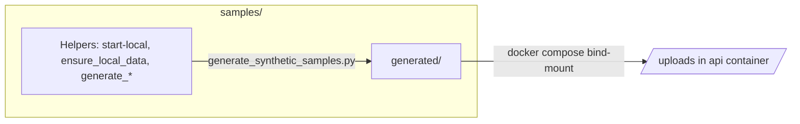

<div align="center">

# Samples

**Local helpers & synthetic documents** for RCM Guardian (no real PHI).

[](./README.md)
[](../docker-compose.yml)
[](https://www.python.org/)

<br/>


<br/>


</div>

---

## Contents

| | |
| :--- | :--- |
| 📂 | [What lives here](#what-lives-here) |
| 🔢 | [Ordinal reference](#ordinal-reference-generated-synthetic-files) |
| ⚡ | [Commands](#commands) |
| 🔁 | [Data flow (Mermaid)](#data-flow) |

---

## What lives here

| Path | Purpose |
|------|---------|
| **`start-local.ps1`** / **`start-local.sh`** | From **repo root**: checks `.env` for OpenAI + LangSmith keys, ensures **`samples/generated/`** exists, then **`docker compose up --build`**. |
| **`ensure_local_data.py`** | Seed payer rules in Postgres without starting the API: `python samples/ensure_local_data.py` (run from **repo root**). |
| **`generate_synthetic_samples.py`** | Writes five ordinal pairs **`synthetic_eob_01` … `_05`**: **`.pdf` and `.png` are different synthetic documents** (not a PNG export of the PDF), each with its own **`asset_key`**. |
| **`generated/`** | **Gitignored** PDF/PNG outputs. Compose bind-mounts this directory to **`/uploads`** in the `api` service. |
| **`assets/`** | **Committed** SVG diagrams used by this README (not patient data). |

Each synthetic file embeds a **stable `asset_key`** line. The generator **requires all 10 outputs to have distinct SHA-256** hashes.

---

## Ordinal reference (`generated/` synthetic files)

Each `synthetic_eob_NN.pdf` and `synthetic_eob_NN.png` is a **different** scenario (definitions in **`generate_synthetic_samples.py`**).

| Ordinal | PDF | PNG |
|--------|-----|-----|
| 01 | EOB / office + lab | Pharmacy remittance |
| 02 | Urgent care claim summary | PT plan of care |
| 03 | ASC / surgery | Molecular lab requisition |
| 04 | DME / CPAP | Home health authorization |
| 05 | Radiology (landscape) | Mammography screening (portrait) |

---

## Commands

Regenerate synthetic PDFs and PNGs (**repo root**):

```bash
python samples/generate_synthetic_samples.py
```

---

## Data flow



---

**Do not** place real PHI in **`generated/`**.
